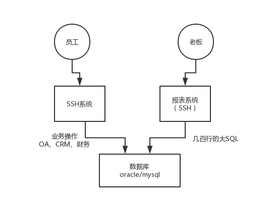

从0入门开始，定位是，只要你有比较不错的java基础，就一定能够听得懂的大数据课程，从0开始863065649

2个场景：

（1）互联网公司，电商公司，假设类似于京东，在互联网上售卖商品，人家老板，有一个需求，咱们这个公司每天都在不断的运行着，我现在就好奇，我想看看，咱们这个网站售卖的最好的商品是哪些，每天的售卖的数量是多少

（2）传统行业，电信公司，人家的高管，高层，我现在就想看看每年一共会有多少人打出多少分钟的电话，发送多少条短信，消耗多大GB的流量

2014年以前，其实从只要你有电脑开始，有互联网开始，上面这两种需求就都是存在的

只要你有了互联网，人家互联网网站一定会不断的运行，新闻门户网站，社交网站，老板总是要看一些数据的，每个版块每天被访问的次数，最热门的10篇文章分别被访问多少次，社交网站，每天活跃进行聊天的用户有多少个，平均每天耗费在我们网站上的时间是多少分钟

只要从你有电脑开始，软件，90年代开始，各行各业，传统行业，他们都是开始电脑化办公，无纸化办公，软件，OA系统、CRM系统、财务系统、进销存系统、工厂管理系统，皮革厂、电力局、电信公司、银行，就会积累一定的业务数据，传统行业的老板也会要看一些数据的

皮革厂老板，我想看一下财务数据，每天大概有多少订单，每年的旺季是什么时候；电力局，我们要统计一下，全国各地，哪些地方的用电量是最大的，每个省每天的用电量分别是多少，数据

在各行各业里面，只要有互联网、软件，中高层，老板，都要看数据，看数据才了解他的这个公司整体的运行的情况，看数据，最最主要的就是帮助公司里的各个层次的人了解到这个公司运行发展的方方面面的情况

从而让公司的管理者可以更好的去了解自己的公司，管理自己的公司

互联网行业，传统行业的软件系统，他们的数据都存放在哪里？2014年以前，2010年~2012年左右，当时最火的不是什么所谓的大数据，当时DBA，Oracle DBA，当时公认的都是Oracle是数据库行业的老大

无论是互联网，还是传统行业，数据都存放在oracle里面，mysql

SSH框架（Struts2 + Spring 3 + Hibernate + java系统）+ oracle，搞定，java工程师，搞定这套东西，就可以拿个月薪几k了，四五千，技术发展还是比较low的

数据报表从哪儿出？

从oracle里出了，2014年以前，2013年以前，2010年以前，在国内，oracle出报表，mysql出报表，很正常的一个事儿

当时就是直接写一个巨复杂的大SQL，几百行，几千行，直接查库，写一个小系统，定时调度，一下，每天凌晨的时候，系统没人用，跑一个大SQL在oracle上面，耗时几十分钟，甚至一两个小时，跑成功一个大SQL

产出一张报表的数据

第二天，老板过来，就可以看报表

然后这个是指的是数据量还相对大一些，比如库里存放了几十万数据，几百万数据，跑SQL很慢的

如果你的数据量很小，几千条，几万条，随时随地，只要老板要看报表，直接点个按钮，然后直接现场一条几百行的大SQL跑到oracle里去查询出来一张报表，可能稍微慢一点点，大概耗费个几十秒，几分钟

