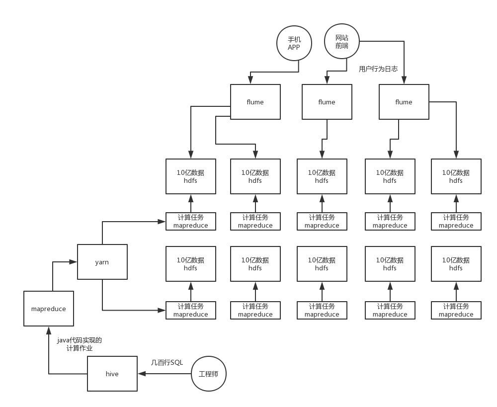

大数据诞生的前夕，国内的趋势

数据量太大，一台机器存不下；存多台机器没法计算

存储大数据的技术，计算大数据的技术，是没有的

平地一声惊雷，2013年开始出现大数据的概念，BAT等大公司当时率先引入了国外的开源的大数据的技术，2010年开始，BAT的一些大公司，团队，已经开始尝试自己研发能够存储和计算大数据的分布式系统了，我也就是当时的一员

2015年开始，大数据就开始变得非常流行了，各种培训机构如雨后春笋般涌现出来，都是号称的是从0基础培训，4个月，6个月培训一下就懂大数据了，就可以干活儿了

hdfs + yarn + mapreduce

hdfs：分布式存储系统，将庞大的数据分布式存储在很多台机器上，hadoop distributed filesystem，hadoop的分布式文件系统

大数据的本质，就是分布式系统，分布式存储系统，分布式资源调度系统，分布式计算系统，分布式流式处理系统，分布式作业调度系统，分布式搜索引擎，分布式NoSQL数据库，分布式数据仓库

各种各样的分布式系统

mapreduce：分布式计算系统，比如说你现在要对100亿条数据进行计算，但是这100亿条数据分布在10台机器上，你该怎么计算呢？难道先针对1台机器上的10亿数据，先算，算好了以后，再算第二台机器上的数据

yarn：分布式资源调度系统，yarn负责将你的计算任务给调度和分发到各个机器上去运行

mapreduce，一个一个的计算任务，你要定义好如何计算和处理每台机器上的数据，基于mapreduce的java api来写java代码的，写java代码还是挺慢的，尤其是出一些数据报表的时候

oracle，几百行的大SQL，很容易就可以写完出一份复杂报表的SQL

大数据技术，hdfs + yarn + mapreduce之后，我还得写java代码，我得用java代码来实现几百行大SQL的计算逻辑，所以现在几乎已经没有人写java代码来进行计算了

做数据分析、统计、出报表，一般都是用SQL的

hive：分布式数据仓库，依赖于mapreduce，干的事情只有一件，将SQL翻译为基于mapreduce的java代码，将你的SQL翻译为基于mapreduce java api的java代码，还是找yarn，提交计算任务，yarn负责将你的计算任务分发到各个机器上去执行，当时有了hive之后，真是解放了全人类，在最开始做大数据开发的时候，还做不了太复杂的报表，只能出一些简单的数据指标和报表，当时开发效率太差了，基于mapreduce来写java代码实现计算的逻辑

flume：分布式日志采集系统，手机APP、网站前端不是会发送大量的日志到后台么？后台接收到了这个日志之后，就需要将这个日志通过flume上传到hdfs上去

最早最早，其实就是用这样的一套东西，就可以支撑最最起码的，针对海量的数据，大量的数据，大数据，用各种各样的分布式系统，实现针对几十亿数据，几百亿数据，甚至是几千亿数据的一个数据分析和统计，产出各种各样的数据报表

大数据技术 = 分布式技术 = 大规模复杂的分布式系统架构

hadoop技术，就是针对大量的数据进行存储、调度和计算的一套分布式系统架构

hbase：分布式NoSQL数据库，他底层是基于hdfs分布式存储来实现的，但是他基于hdfs封装和开发了一套分布式NoSQL数据库，你可以基于hbase实现大量的NoSQL数据库的一些操作，毫秒级~秒级的增删改查

spark生态：分布式计算（替代以前的mapreduce，速度更快，性能更高），spark sql（支持你直接基于spark写大SQL，跑报表统计），spark streaming（针对源源不断过来的数据流，进行分布式的流式计算），spark mllib（基于分布式存储的数据，进行分布式的机器学习）

elasticsearch：分布式数据存储+搜索，基于es分布式存储一些数据，针对数据可以做类似于搜索引擎一样的搜索

kylin：分布式OLAP分析，写一些SQL去跑查询和统计

druid：分布式流式的分析和统计

flink：分布式计算，分布式流式数据的处理

