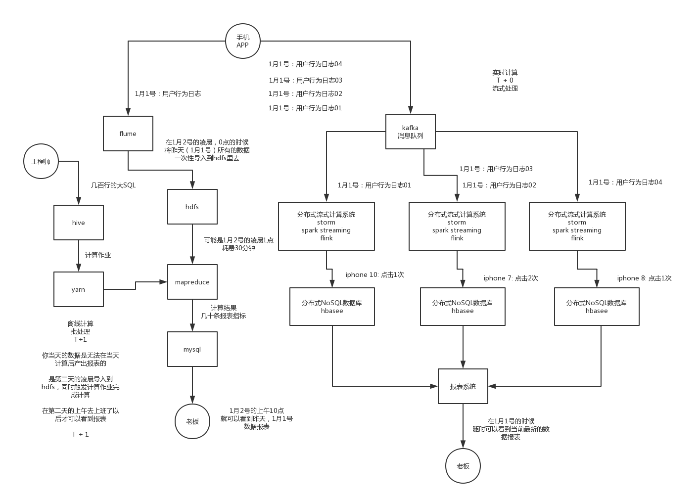

大数据，一定要给大家从0开始入门的同学，理清楚一些概念，我的讲法，以及课程的编排是跟其他的培训机构，4个月，5个月，从0转型到大数据的一些课程

自己研发类似于hdfs、mapreduce、yarn的一些分布式系统，来实现大数据的分布式存储、分布式计算、分布式资源调度

离线计算，实时计算

几十亿条数据，算出来一张报表，可能就几十条数据而已

用户的每一次操作。。。。
用户的每一次操作。。。。
用户的每一次操作。。。。

。。。3万5千行数据

算出来的报表，iphone 10被点击了35000次

分布式流式计算系统，来一条日志，就计算一条

hdfs，分布式存储

第一个作用，在离线计算里，作为基础的分布式数据存储，供每天凌晨批量计算昨天的数据

第二个作用，在实时计算里，作为基础的分布式数据存储，为hbase分布式NoSQL数据库提供支持，支持实时计算

就是一个分布式存储系统，主要的作用还是在于离线计算里面
