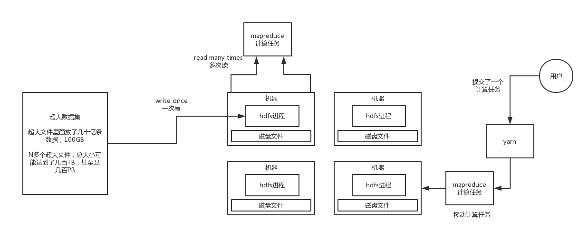

因为hdfs其实本质说白了就是个分布式文件系统，那所以你得考虑一下，比如跟fastdfs之类的java架构领域的一些分布式文件系统相比，
他的特点和优势在哪儿呢，下面就是说一下hdfs作者对他的整体架构的一些设计理念

**（1）支持超大数据集**

hdfs这种分布式存储，其实为啥要分布式存储呢？就是因为数据量太大了，比如说某个表，有30亿数据，你难道存在mysql里？就一台机
器里？所以用了hdfs分布式存储，就是可以放在N多台机器上，每台机器放这个大数据集的一部分，比如就放300万条数据。

所以hdfs定位就是针对这种超大数据集的。

**（2）绝对能够应对硬件的故障**

大数据的理念，是说不要用那种商用的小型机，服务器，商用的存储设备

一遍来说大数据的系统都是部署在普通的机器上面的，一遍来说很有可能就是16核64G的物理机

因为就目前国内的大数据整体情况来看，一般那种外包类的大数据公司，给客户做个项目，大概也就是几十台机器，甚至很多小公司做
所谓的大数据，可能就十几台机器；然后如果是中等规模的互联网公司，一般会是上百台机器的规模；如果是那种大型互联网公司，那
么上千台机器规模就是很正常的了，甚至是几万台机器

但是一般大数据用的都是普通的机器，比如说那种16核64G的机器，一般不会用那种性能超级高的、稳定性巨好的服务器。所以说这种普
通机器其实出故障的概率还是蛮高的，比如说磁盘故障，突然不能读写了，或者是网络故障

那hdfs第一个设计理念，就是可以自动探查到集群中某一台机器故障了，然后可以自动对故障进行恢复，而且速度要比较快一些，比1个
小时才检测到故障

**（3）流式数据处理**

这个啥意思呢，就是说hdfs读写文件系统上的数据的时候，是基于流的一种概念来的，英文名词是：streaming access。你现在先别
纠结这个是啥意思了，死记硬背就ok了，然后记住，hdfs用这个所谓的流式数据处理，其实主要就是为了保证高吞吐量的文件读写，
而不是低延迟的文件读写。

hdfs是用在离线批处理场景的，尤其是数据仓库，数据分析这块。今天凌晨把昨天所有的数据都给在比如半小时内处理完毕。而不是
数据来一条你就算一条。

分布式系统，相当于就是你自己用Java开发出来的系统，jvm进程

**（4）简化的数据一致性模型**

同时支持对文件的写和读，很麻烦的，大量的并发冲突问题

因为这个hdfs是为了支持超大数据集，分布式存储，离线批量处理的，所以说，他的数据一致性模型是简化的，在他这里的话，一个
文件只能一次写入，然后之后就只能追加，不能随便改之前的数据了

他的理念就是，write-once，ready-many-times，一次写，然后多次读，这样就没有数据读写并发冲突，以及数据如何维护一致性的
问题了。

**（5）尽量移动计算，但是不要移动数据**

这个意思就是说，如果你要对分布在多台机器上的数据，进行分布式计算，使用比如mapreduce或者是spark都可以，那么此时尽可能让
你的计算任务是靠近这个数据，而不是说在集群里通过网络胡乱传输数据，那样会导致性能极差极差

移动数据
