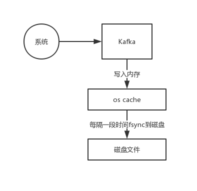

batch微批处理，高吞吐高延迟，kafka相反，高吞吐低延迟

直接写入os的page cache中

文件，kafka仅仅是追加数据到文件末尾，磁盘顺序写，性能极高，几乎跟写内存是一样高的。磁盘随机写，你要随机在文件的某个位置修改数据，
这个叫做磁盘随机写，性能是很低的，磁盘顺序写，仅仅追加数据到文件末尾

而且写磁盘的方式是顺序写，不是随机写，性能跟内存写几乎一样。就是仅仅在磁盘文件的末尾追加写，不能在文件随机位置写入

假设基于上面说的os cache写 + 磁盘顺序写，0.01毫秒，低延迟，高吞吐，每毫秒可以处理100条数据，每秒可以处理10万条数据，不需要依托
类似spark straeming那种batch微批处理的机制

正是依靠了这个超高的写入性能，单物理机可以做到每秒几十万条消息写入Kafka

这种方式让kafka的写性能极高，最大程度减少了每条数据处理的时间开销，反过来就大幅度提升了每秒处理数据的吞吐量，一般kafka部署在物理
机上，单机每秒写入几万到几十万条消息是没问题的

这种方式是不是就兼顾了低延迟和高吞吐两个要求，尽量把每条消息的写入性能压榨到极致，就可以实现低延迟的写入，同时对应的每秒的吞吐量自然
就提升了

所以这是kafka非常核心的一个底层机制

而且这里很关键的一点，比如rabbitmq这种消息中间件，他会先把数据写入内存里，然后到了一定时候再把数据一次性从内存写入磁盘里，但是kafka
不是这种机制，他收到数据直接写磁盘

只不过是写的page cache，而且是磁盘顺序写，所以写入的性能非常高，而且这样不需要让kafka自身的jvm进程占用过多内存，可以更多的把内存空间
留给os的page cache来缓存磁盘文件的数据

只要能让更多的磁盘数据缓存在os cache里，那么后续消费数据从磁盘读的时候，就可以直接走os cache读数据了，性能是非常高的

