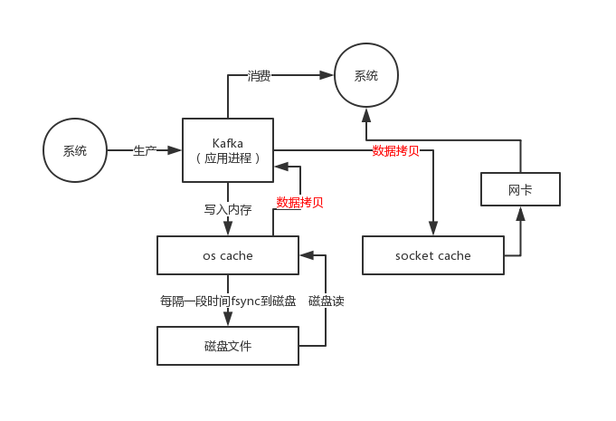
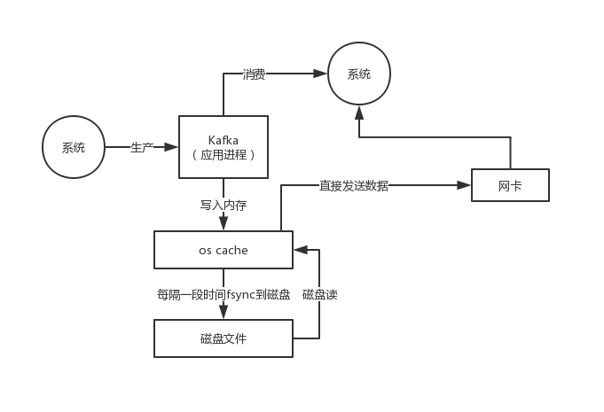

那么在消费数据的时候，需要从磁盘文件里读取数据后通过网络发送出去，这个时候怎么提升性能呢？

首先就是利用了page cache技术，之前说过，kafka写入数据到磁盘文件的时候，实际上是写入page cache的，没有直接发生磁盘IO，所以写入的
数据大部分都是停留在os层的page cache里的

这个本质其实跟elasticsearch的实现原理是类似的

然后在读取的时候，如果正常情况下从磁盘读取数据，先尝试从page cache读，读不到才从磁盘IO读，读到数据以后先会放在os层的一个page  cache里，
接着会发生上下文切换到系统那边，把os的读缓存数据拷贝到应用缓存里

接着再次发生上下文二切换到os层，把应用缓存的数据拷贝到os的socket缓存中，最后数据再发送到网卡上

这个过程里，发生了好几次上下文切换，而且还涉及到了好几次数据拷贝，如果不考虑跟硬件之间的交互，起码是从os cache到用户缓存，从用户缓存到
socket缓存，有两次拷贝是绝对没必要的

但是如果用零拷贝技术，就是linux的sendfile，就可以直接把操作交给os，os看page cache里是否有数据，如果没有就从磁盘上读取，如果有的话直接
把os cache里的数据拷贝给网卡了，中间不用走那么多步骤了

对比一下，是不是所谓的零拷贝了？

所以呢，通过零拷贝技术来读取磁盘上的数据，还有page cahce的帮助，这个性能就非常高了
