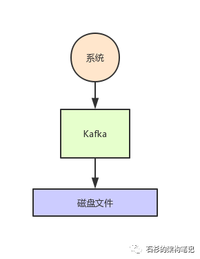
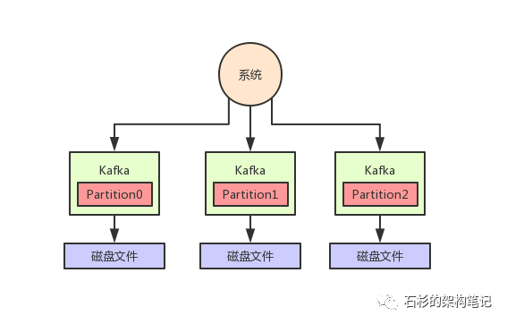
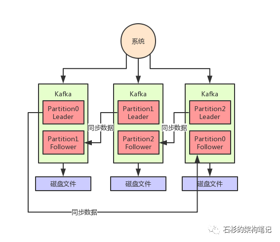
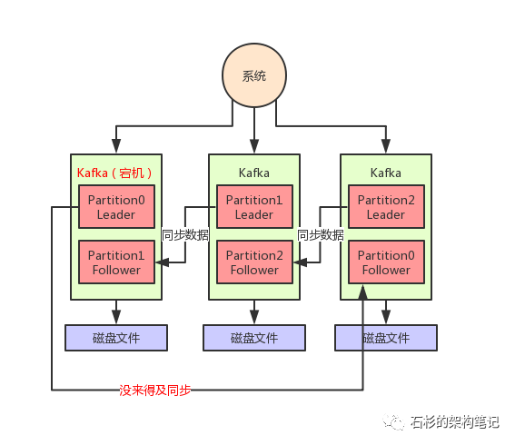
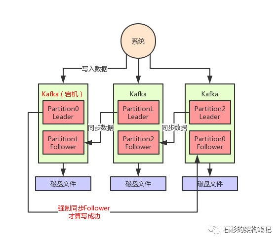

# 目录

**1、背景引入**

**2、Kafka分布式存储架构**

**3、Kafka高可用架构**

**4、画图复现Kafka的写入数据丢失问题**

**5、Kafka的ISR机制是什么？**

**6、Kafka写入的数据如何保证不丢失？**

**7、总结**

**（1）背景引入**

这篇文章，给大家聊一下写入Kafka的数据该如何保证其不丢失？

看过之前的文章《面试官：消息中间件如何实现每秒几十万的高并发写入》的同学，应该都知道写入Kafka的数据是会落地写入磁盘的。

我们暂且不考虑写磁盘的具体过程，先大致看看下面的图，这代表了Kafka的核心架构原理。

**（2）Kafka分布式存储架构**

那么现在问题来了，如果每天产生几十TB的数据，难道都写一台机器的磁盘上吗？这明显是不靠谱的啊！

所以说，这里就得考虑数据的分布式存储了，其实关于消息中间件的分布式存储以及高可用架构，之前的一篇文章
《面试一线互联网大厂？那这道题目你必须得会！》也分析过了，但是这里，我们结合Kafka的具体情况来说说。

在Kafka里面，有一个核心的概念叫做“Topic”，这个topic你就姑且认为是一个数据集合吧。

举个例子，如果你现在有一份网站的用户行为数据要写入Kafka，你可以搞一个topic叫做“user_access_log_topic”，这里写入的
都是用户行为数据。

然后如果你要把电商网站的订单数据的增删改变更记录写Kafka，那可以搞一个topic叫做“order_tb_topic”，这里写入的都是订单
表的变更记录。

然后假如说咱们举个例子，就说这个用户行为topic吧，里面如果每天写入几十TB的数据，你觉得都放一台机器上靠谱吗？

明显不太靠谱，所以Kafka有一个概念叫做Partition，就是把一个topic数据集合拆分为多个数据分区，你可以认为是多个数据分片，
每个Partition可以在不同的机器上，储存部分数据。

这样，不就可以把一个超大的数据集合分布式存储在多台机器上了吗？大家看下图，一起来体会一下。

**（3）Kafka高可用架构**

但是这个时候，我们又会遇到一个问题，就是万一某台机器宕机了，这台机器上的那个partition管理的数据不就丢失了吗？

所以说，我们还得做多副本冗余，每个Partition都可以搞一个副本放在别的机器上，这样某台机器宕机，只不过是Partition其中一个副本丢失。

如果某个Partition有多副本的话，Kafka会选举其中一个Parititon副本作为Leader，然后其他的Partition副本是Follower。

只有Leader Partition是对外提供读写操作的，Follower Partition就是从Leader Partition同步数据。

一旦Leader Partition宕机了，就会选举其他的Follower Partition作为新的Leader Partition对外提供读写服务，这不就实现了高可用架构了？

大家看下面的图，看看这个过程。

**（4）Kafka写入数据丢失问题**

现在我们来看看，什么情况下Kafka中写入数据会丢失呢？

其实也很简单，大家都知道写入数据都是往某个Partition的Leader写入的，然后那个Partition的Follower会从Leader同步数据。

但是万一1条数据刚写入Leader Partition，还没来得及同步给Follower，此时Leader Partiton所在机器突然就宕机了呢？

大家看下图：

如上图，这个时候有一条数据是没同步到Partition0的Follower上去的，然后Partition0的Leader所在机器宕机了。

此时就会选举Partition0的Follower作为新的Leader对外提供服务，然后用户是不是就读不到刚才写入的那条数据了？

因为Partition0的Follower上是没有同步到最新的一条数据的。

这个时候就会造成数据丢失的问题。

**（5）Kafka的ISR机制是什么？**

现在我们先留着这个问题不说具体怎么解决，先回过头来看一个Kafka的核心机制，就是ISR机制。

这个机制简单来说，就是会自动给每个Partition维护一个ISR列表，这个列表里一定会有Leader，然后还会包含跟Leader保持同步的Follower。

也就是说，只要Leader的某个Follower一直跟他保持数据同步，那么就会存在于ISR列表里。

但是如果Follower因为自身发生一些问题，导致不能及时的从Leader同步数据过去，那么这个Follower就会被认为是“out-of-sync”，从ISR列表里踢出去。

所以大家先得明白这个ISR是什么，说白了，就是Kafka自动维护和监控哪些Follower及时的跟上了Leader的数据同步。

**（6）Kafka写入的数据如何保证不丢失？**

所以如果要让写入Kafka的数据不丢失，你需要要求几点：

**1.每个Partition都至少得有1个Follower在ISR列表里，跟上了Leader的数据同步**

**2.每次写入数据的时候，都要求至少写入Partition Leader成功，同时还有至少一个ISR里的Follower也写入成功，才算这个
写入是成功了**

**3.如果不满足上述两个条件，那就一直写入失败，让生产系统不停的尝试重试，直到满足上述两个条件，然后才能认为写入成功**

**4.按照上述思路去配置相应的参数，才能保证写入Kafka的数据不会丢失**

好！现在咱们来分析一下上面几点要求。

***第一条，*** 必须要求至少一个Follower在ISR列表里。

那必须的啊，要是Leader没有Follower了，或者是Follower都没法及时同步Leader数据，那么这个事儿肯定就没法弄下去了。

***第二条，*** 每次写入数据的时候，要求leader写入成功以外，至少一个ISR里的Follower也写成功。

大家看下面的图，这个要求就是保证说，每次写数据，必须是leader和follower都写成功了，才能算是写成功，保证一条数据必须有两个以上的副本。

这个时候万一leader宕机，就可以切换到那个follower上去，那么Follower上是有刚写入的数据的，此时数据就不会丢失了。

如上图所示，假如现在leader没有follower了，或者是刚写入leader，leader立马就宕机，还没来得及同步给follower。

在这种情况下，写入就会失败，然后你就让生产者不停的重试，直到kafka恢复正常满足上述条件，才能继续写入。

这样就可以让写入kafka的数据不丢失。

**（7）总结**

最后总结一下，其实kafka的数据丢失问题，涉及到方方面面。

譬如生产端的缓存问题，包括消费端的问题，同时kafka自己内部的底层算法和机制也可能导致数据丢失。

但是平时写入数据遇到比较大的一个问题，就是leader切换时可能导致数据丢失。所以本文仅仅是针对这个问题说了一下生产环境解决这个问题的方案。

**End**

