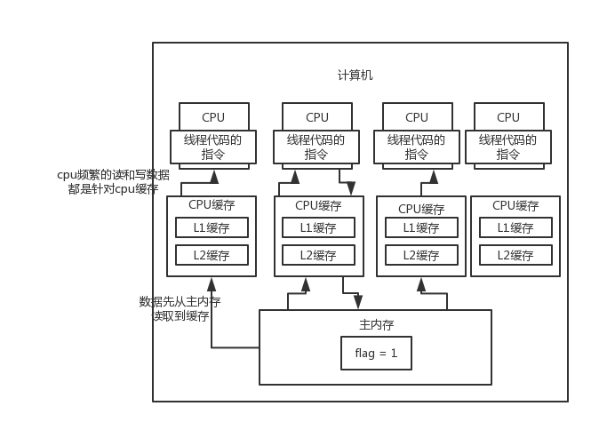

演示了一下开了多线程以后，如果多个线程共用一个共享变量，有人写，有人读，那么其实是有问题的，有可能会导致有的线程没法
及时读到比人修改的变量的值，一直读到的就是老的值

volatile关键字，就是用来解决这个问题的，尽量让你修改了一个变量之后，其他的线程可以立即看到这个变量的最新的值

cpu缓存模型 -> java内存模型 -> 原子性、可见性、有序性 -> volatile的作用 -> volatile的底层原理 -> volatile实战

上网搜一些volatile的博客，那些人写的天花烂坠，描述的一点都不清楚

操作系统层面的东西

遇到一个问题，现代的计算机技术，内存的读写速度没什么突破，cpu如果要频繁的读写主内存的话，会导致性能较差，计算性能就会低，
这样的不适应现代计算机技术的发展

现代的计算机，一般来说，都不是这么玩儿的

换了一种玩法，给cpu加了几层缓存

主要就是说，cpu可以直接操作自己对应的高速缓存，不需要直接频繁的跟主内存通信，这个是现代计算机技术的一个进步，这样可以
保证cpu的计算的效率非常的高
