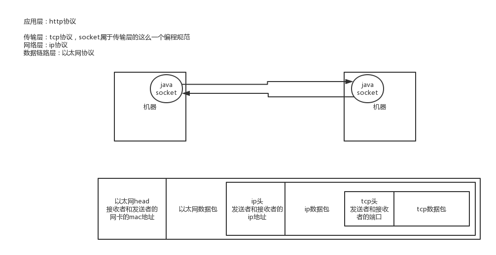

1、面试题

说说socket通信的原理？

2、面试官心里分析

其实不知道大家发现没有，网络相关的问题，都是围绕着所谓的七层模型，或者是四层模型去走的。聊完四层模型，接着就是一次请求的全过程，紧接着就是聊传输层的tcp的连接，然后就是传输层的tcp协议之上的socket编程，接下来还会聊聊应用层的http协议。

所以说，来吧，这都是最最基础的网络知识。

3、面试题剖析

其实说白了，socket就是在传输层里把tcp/ip协议给封装了一下，我们程序员一般都是面向socket来编程的，比如java原生就支持socket网络编程的。

大体来说这个步骤，就是我们搞一个ServerSocket无限等待别人来连接你，然后某个机器要跟你连接，就在本地创建一个socket去连接你，然后建立连接之后，在服务器上，ServerSocket也会创建出来一个socket的。通过客户端的socket跟服务端的socket进行通信，我给你写数据，你读数据，你给我写数据，我读数据，就这个过程。

当然这个底层，比如建立连接和释放连接，都是基于tcp三次握手和四次挥手的规范来搞的，包括基于tcp协议传输数据，其实就跟我们之前说的一样，都是封装个tcp数据包，里面有tcp报头，整了端口号啥的，然后封装在ip数据包里，最后封在以太网数据包里传递。

就这么回事，大家理解了就好了。

