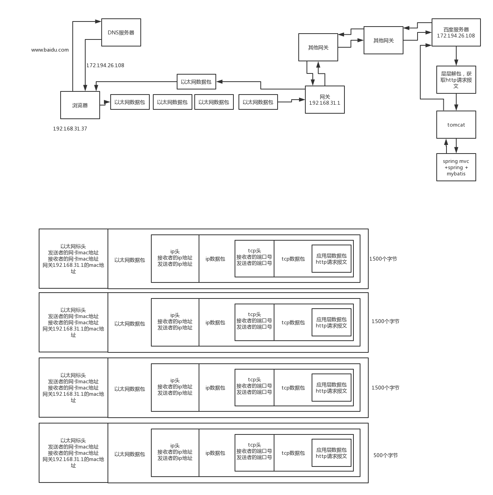

1、面试题

用浏览器请求一个链接的时候，经历了哪些过程（DNS解析过程）？

2、面试官心里分析

这个问题，其实就是跟之前的那个一样，他就是考察考察你的基本功，看你对基本的网络通信知识有没有了解。而且话说回来，考察一个人的基本功，就这个问题应该是相当经典和直接的一个问题，你理解清楚了，那么网络通信这块的一些基本概念，你基本都了解了。否则有的人连个网卡是啥都不知道，mac地址更是懵逼。

3、面试题剖析

现在我们知道网络七层模型大概都是怎么回事了，然后四层模型其实就是会话层、表示层和应用层，合并为了一个应用层，同时没把物理层算在内。就这样。

而且我们也大概知道每一层的协议和作用，网络通信的时候都是怎么回事了，现在我们来看看假设通过浏览器发送一个请求，你访问到那个网站对应的机器，然后人家再给你一个响应的全过程。

现在我们先假设，我们给电脑设置了几个东西：

ip地址：192.168.31.37
子网掩码：255.255.255.0
网关地址：192.168.31.1
DNS地址：8.8.8.8

完了，我们打开一个浏览器，请求www.baidu.com地址，这个时候找DNS服务器，DNS服务器解析域名之后，返回一个ip地址，比如172.194.26.108。接着会判断两个ip地址是不是一个子网的，用子网掩码255.255.255.0，对两个ip地址做与运算，拿到192.168.31.0和172.194.26.0，明显不是一个子网的。

那就得发送一个数据包给网关，其实你就认为是我们的路由器吧，就是192.168.31.1，而且我们是可以拿到网关ip地址的mac地址的，现在我们从应用层出发，通过浏览器访问一个网站，是走应用层的http协议的。

既然要把浏览器发出的请求打包成数据包，要把哪些东西给放到数据包中去呢？应该是把http请求给打包到数据包中去。

http协议分为几个部分：

请求方法 + URL地址 + http版本：比如GET http://172.194.26.108/test HTTP/1.1，类似这种

请求头，类似下面这种：

Host: upload.jiangsu.io
Proxy-Connection: keep-alive
User-Agent: Mozilla/5.0

空行

请求体，比如常见的可以放一个json

这就构成了一个http请求报文

浏览器请求一个地址，先按照应用层的http协议，封装一个应用层数据包，数据包里就放了http请求报文

这个时候会将这个http请求报文打包成一个数据包，仅仅只是数据包的数据部分，此时是数据包是没有头的。上面根据http协议搞一个http请求报文，然后搞一个数据包出来，就是网络模型中到的应用层干的事儿了。

接着就是跑传输层来了，这个层是tcp协议，这个tcp协议会让你设置端口，发送方的端口随机选一个，接收方的端口一般是默认的80端口。这个时候，会把应用层数据包给封装到tcp数据包中去，而且会加一个tcp头，这个tcp数据包是对应一个tcp头的，这个tcp头里就放了端口号信息。

接着跑到网络层来了，走ip协议，这个时候会把tcp头和tcp数据包，放到ip数据包里去，然后再搞一个ip头，ip头里本机和目标机器的ip地址。这里本机ip地址是192.168.31.37，目标机器是172.194.26.108。

应为，通过ip协议，可以判断说，两个ip地址不是在一个子网内的，所以此时只能将数据包先通过以太网协议广播到网关上去，通过网关再给他发送出去

接着是数据链路层，这块走以太网协议，这里是把ip头和ip数据包封到以太网数据包里去，然后再加一个以太网数据包的头，头里放了本机网卡mac地址，和网关的mac地址。但是以太网数据包的限制是1500个字节，但是假设这个时候ip数据包都5000个字节了，那么需要将ip数据包切割一下。

这个时候一个以太网数据包要切割为4个数据包，每个数据包包含了以太网头、ip头和切割后的ip数据包，4个数据包的大小分别是1500，1500,1500，560。ip头里包含了每个数据包的序号。

这4个以太网数据包都会通过交换机发到你的网关上，然后你的路由器是可以联通别的子网的，这个是时候你的路由器就会转发到别的子网的可能也是某个路由器里去，然后以此类推吧，N多个路由器或者你叫网关也行，N多个网关转发之后，就会跑到百度的某台服务器，接收到4个以太网数据包。

百度服务器接收到4个以太网数据包以后，根据ip头的序号，把4个以太网数据包里的ip数据包给拼起来，就还原成一个完整的ip数据包了。接着就从ip数据包里面拿出来tcp数据包，再从tcp数据包里取出来http数据包，读取出来http数据包里的各种协议内容，接着就是做一些处理，然后再把响应结果封装成htp响应报文，封装在http数据包里，再一样的过程，封装tcp数据包，封装ip数据包，封装以太网数据包，接着通过网关给发回去。

